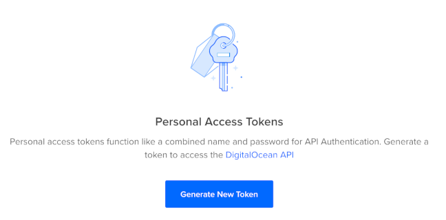
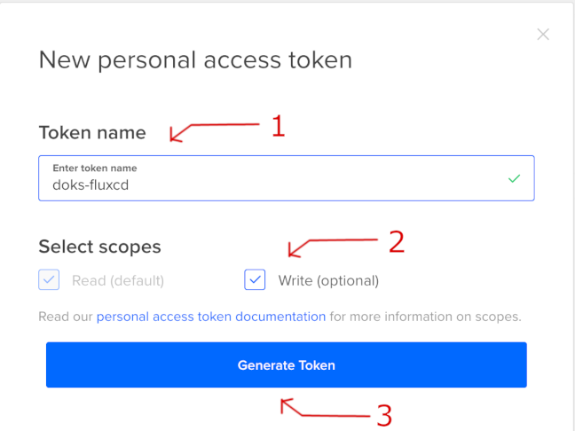
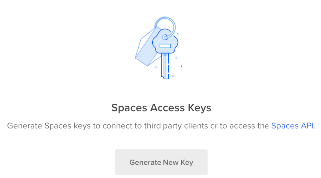
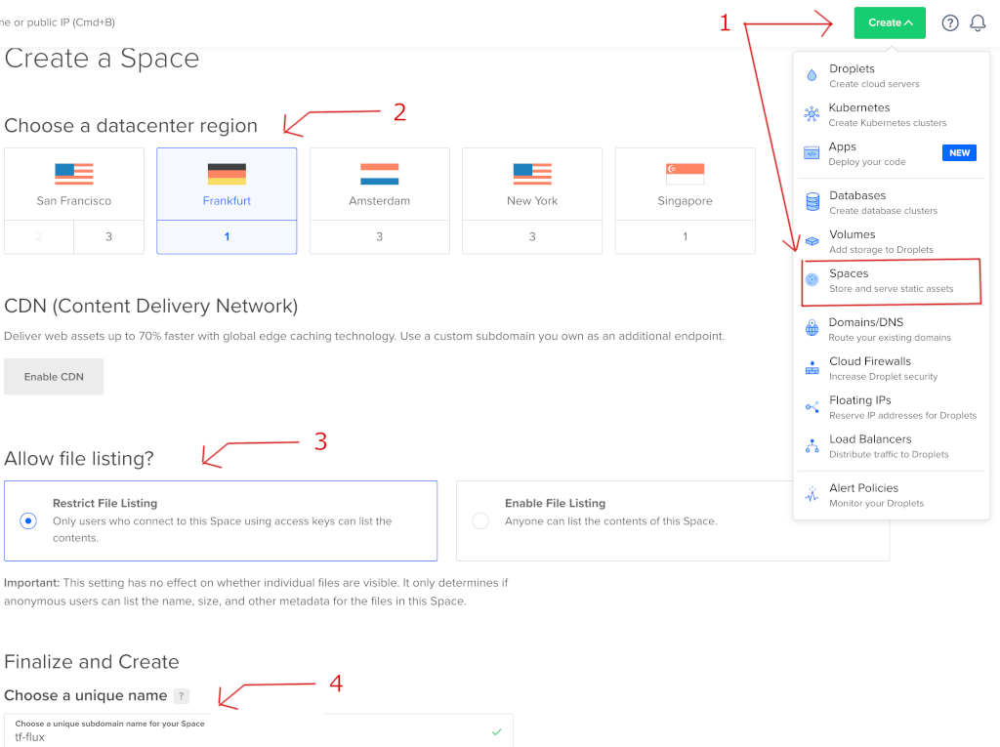

# GitOps via Flux CD and DOKS
This blueprint will guide you step by step on how to spin up a DOKS (DigitalOcean Kubernetes) cluster and Flux CD for K8S deployments management in a GitOps fashion. Everything is done via [Terraform](https://www.terraform.io) and the steps that are required should be pretty straightforward.

## Bootstrapping DOKS and Flux CD

This section contains information about how we can bootstrap **DOKS** and **Flux CD** via **Terraform** using **Github** as a SCM provider and source of truth.

### Requirements:

1. A DigitalOcean [account](https://cloud.digitalocean.com) is required in order to provision the DOKS cluster.
2. Next a [Github](https://github.com/) account is needed with a [personal access token](https://github.com/settings/tokens) that has the `repo` permissions set (save it for later use).
3. A git client needs to be installed as well depending on the distro.
  
    E.g.: on MacOS it can be installed via Homebrew:
    ```bash
    brew info git
    brew install git
    ```

4. [Terraform](https://www.terraform.io/downloads.html) must be installed next. 
    
    E.g.: on MacOS it can be installed via Homebrew:
    ```bash
    brew info terraform
    brew install terraform
    ```

### Installation steps

1. Let's start with setting up the required stuff on the DigitalOcean side by creating the necessary tokens first. One is needed for creating/managing the DOKS cluster and aother one for Spaces (similar to AWS S3). The latter is needed for storing the Terraform state file. Please copy the secrets and keep them safe because we will need them later on.
   
    From your DigitalOcean account go to [API](https://cloud.digitalocean.com/account/api) section in order to generate the tokens. 
    
    Create a personal access token first by clicking the big blue `Generate New Token` button:

    

    then make sure to give it a proper name and that the `Write` scope is checked:

    

    In the end we should have something like this (**don't forget to copy the key as we will need it later on**):

    

    Next we navigate to `Spaces access keys` and click the `Generate New Key` button:

    

    then give it a proper name and mark it as done:

    

    In the end we should have something like this (**don't forget to copy the keys as we will need them later on**):

    

2. Going further we have to create a DO Space for storing the Terraform state file. Go ahead to your DigitalOcean account panel and click on the `Create` green button from the upper right corner. Select a region that's more closer to you then make sure that `Restrict file listing` is checked and finally give it a proper name. The required steps are highlighted below:

    

3. Clone this repository on your local machine:
   
    `git clone https://github.com/mtiutiu-heits/do-gitops-testing.git`

4. Change directory to `flux-cd/bootstrap/terraform`
   
    `cd flux-cd/bootstrap/terraform`

5. Terraform initialization must be perfomed next. A [DO Spaces](https://cloud.digitalocean.com/spaces) backend for storing the Terraform state file is highly recommended because we do not have to worrry about exposing sensitive data as long as the space is private of course. Another advantage is that the state of our infrastructure is backed up so we can re-use it in order to do a refresh and change only the affected parts which is a great and powerful feature of Terraform in the end. Having a common shared space across more team members is desired as well in order to perform collaborative work via Terraform.
   
    A DO Spaces Terraform backend must be created for the next step so we need to provide the `backend.tf` file:

    ```bash
    cp backend.tf.sample backend.tf
    ```
    The new `backend.tf` file must be reviewed and modified accordingly to provide the appropriate values for `endpoint`, `region`, `bucket` and `key` (explanations provided there).

    Using the previously created `access` and `secret` DO Space keys we need to fill in the `<>` placeholders accordingly and create the backend:
   
    ```bash
    terraform init  --backend-config="access_key=<your_do_spaces_access_key>" --backend-config="secret_key=<your_do_spaces_secret_key>"
    ```

    Sample output:
    ```
    Initializing the backend...

    Successfully configured the backend "s3"! Terraform will automatically
    use this backend unless the backend configuration changes.

    Initializing provider plugins...
    - Finding hashicorp/kubernetes versions matching "2.3.2"...
    - Finding gavinbunney/kubectl versions matching "1.11.2"...
    ...
    ```
6. A Terraform `project.tfvars` variables file needs to be created next (this **must not** be commited in git as it may contain sensitive data - the `.gitignore` is already set to ignore this kind of file).
    There's a [project.tfvars.sample](flux-cd/bootstrap/terraform/project.tfvars.sample) file provided in this repo so we can just rename it:

    ```bash
    cp project.tfvars.sample project.tfvars
    ```
    And then fill in the right values for the project ([variables.tf](flux-cd/bootstrap/terraform/variables.tf) contains the description for each variable).
    
7. Going furher let's create a `plan` in order to inspect the infrastructure changes:

    `terraform plan -var-file="project.tfvars"`

8. If everything seems alright then `apply` the changes with: 
   
    `terraform apply -var-file="project.tfvars"`

    Sample output:
    ```
    tls_private_key.main: Creating...
    kubernetes_namespace.flux_system: Creating...
    github_repository.main: Creating...
    tls_private_key.main: Creation complete after 2s [id=1d5ddec06b0f4daeea57d3a987029c1153ebcb21]
    kubernetes_namespace.flux_system: Creation complete after 2s [id=flux-system]
    kubectl_manifest.install["v1/serviceaccount/flux-system/source-controller"]: Creating...
    kubectl_manifest.sync["kustomize.toolkit.fluxcd.io/v1beta1/kustomization/flux-system/flux-system"]: Creating...
    kubectl_manifest.install["v1/serviceaccount/flux-system/helm-controller"]: Creating...
    kubectl_manifest.install["networking.k8s.io/v1/networkpolicy/flux-system/allow-egress"]: Creating...
    ...
    ```

    If everything goes well after Terraform finishes the DOKS cluster should be up and running as well as Flux CD.

## Next steps

In order to inspect the Kubernetes cluster state as well as Flux CD and getting information about various components we need to install a few tools like:

1. `doctl` for DigitalOcean interaction (most of the tasks that can be done via the DO account web interface can be accomplished using the CLI version as well) 
2. `kubectl` for Kubernetes interaction
3. `flux` for Flux CD interaction

### Doctl

Can be installed for your specific OS and architecture from [here](https://github.com/digitalocean/doctl/releases). On MacOS we can use Homebrew to install it very easily like this:

```bash
brew info doctl
brew install doctl
```

After installation we have to initialize it using the DigitalOcean personal token created at the beginning of this blueprint (the context represents the token name that was assigned to it):

```bash
doctl auth init --context <personal_token_assigned_name>
```

### Kubectl

Please follow the specific steps for your OS and architecture from the official [site](https://kubernetes.io/docs/tasks/tools). On MacOS we can use Homebrew to install it very easily like this:

```bash
brew info kubectl
brew install kubectl
```

Next we have to set kubectl context to point to our cluster created in this blueprint like this:

```bash
doctl k8s cluster kubeconfig save <doks_cluster_name>
```

Where `<doks_cluster_name>` must be replaced with the name given to the cluster in the `project.tfvars` file created in this blueprint (the variable is `doks_cluster_name`).

### Flux

This is the CLI tool used by Flux to provision it as well as interact with it. Can be installed from the [official](https://fluxcd.io/docs/installation) site following the steps specific for your OS.

After installation and if all the above steps for doctl and kubectl were completed successfully we can check flux status with:

```bash
flux check
```

Inspect all resources with:

```bash
flux get all
```

In case we need to do some troubleshooting and also see what Flux CD is doing we can access the logs via:

```bash
flux logs
```